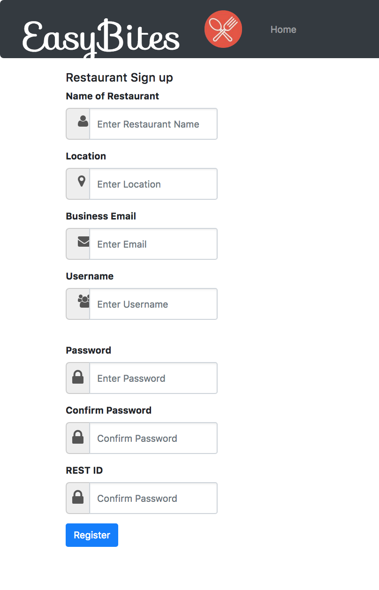

# Solutions.md

## Group Information
 * Name: redrum
 * Product: EasyBites
 * Creators: Thanin Chan, Priyanka Narasimhan

> Nowadays we seem to live among an “acceleration society”, a fast paced environment where everyone seems to always be busy and stressed, occupied with several responsibilities and deadlines. Due to this, time management and efficiency becomes important in everything we do. From personal experience, it is extremely hard for a University student to find a convenient place to eat, or allocate enough time to eat outside, while simultaneously balancing lecture timings, and deadlines. This supported the motivation for building a product that would assist people to find nearby eateries and ordering online to save time.

> This is exactly what our group aimed to create. Our product EasyBites, is a web application that provides a service to both Restaurants as well as Customers, as it creates a more efficient solution to customers making orders and restaurants receiving orders. Its purpose is to manage time, and provide restaurant options for customers to eat at, while at the same time increasing customer crowds at restaurants using this efficient online app.

### Software Tools/ APIs Used: 
> MongoLab was used to set up a Mongo Database
> Zomato API (contains restaurant data for over 10,000 cities in 24 countries) was used to retrieve values about restaurant information (including location, price range, ratings, cuisine type, and restaurant name)
> JQuery was used to send AJAX requests to communicate with the database
> NodeJS was used to set up a runtime environment on the server side (commands using npm)

### Databases Created in MongoLab (MongoDB):
>   * customers -> stores all customers using the application with their registration information
>   * restaurants -> stores all restaurant objects using the application, registration details only
>   * ordersAPI -> stores all order objects (including the unique restaurant ID)
>   * restaurantAPI -> stores an array of orders from customers as well as an array of menu items for a specific restaurant

There are 2 main stakeholders/ end-users to the application. Further details about use cases for both stakeholders are given below:

>* **Customers:**
>   * Customers must register to make an account with EasyBites. They will be required to enter their name, location, email, credit card details as well as enter a unique username and password, which they will use to log in. New users will be redirected to their account’s dashboard immediately after registration, while pre-existing users will have to log in to enter their account. In the customer’s account, the customer can view their favourite restaurant searches and send an order by entering menu details, quantity of each menu item, group size and clicking “submit”. Due to the fact that we were not able to implement a feature where the customer can “favourite” a restaurant search, the restaurants listed under the favourites tab are preset values and will be given to every user account. Clicking the “submit” button sends a POST request to the ordersAPI database and stores the order with a restaurant ID. Customers can also choose to view their profile which makes a GET request to the customers database and displays the information on the screen. Customers can also choose to edit their profile by clicking the “edit” link and modifying fields in the form object on screen, which will send a PUT request to modify that specific customer in the customer database. 

>* **Restaurant:**
>   * Note: Only restaurants listed in the Zomato API may register and create an account.
>   * Similarly, restaurants will have a similar login and registration system. To register, the restaurant needs to enter the restaurant name, location, email and create a unique username. Although the restaurant does not need to enter credit card details like a customer does, they do need to enter their restaurant as specified in the Zomato API. Restaurants can view a list of orders by clicking the “Order Queue” under Tabs. This order queue provides details about the order number customer (name, group size, reservation type whether it be take out or dining) as well as what they have ordered. At the bottom of the page the restaurant can enter an order number and click “submit” which will send a DELETE request to the orderAPI database and remove the order. Another feature involves entering information for phone registrations. The restaurant can choose to enter a customer’s orders through phone by entering the customer’s name, group size to cater to, and menu order. This order will be appended to the order queue for the restaurant. 

### Main Working Features:
>   * Customer /Restaurant registration, login and authentication.
>   * Customer placing an order to the existing 2 restaurants in the Favourites tab.
>   * Customer viewing/updating their profile.
>   * Restaurant viewing and deleting orders placed in their order queue.
>   * Adding orders through a phone registration.
>   * Reading from the Zomato API and returning a list of restaurants in a data table (with name, ratings, cuisine, location and price range) in the splash page.

### Screenshots of EasyBite Views:

Splash Page: The starting page of EasyBites
>
> 

API feature: Gives options for three cities and returns restaurant results in a datatable
>
> 

Customer Registration: 
>
> 

Restaurant Registration: 
>
> 

Sign in Customer: 
>
> 

Sign in Restaurant:
>
> 

Customer profile: View/Update profile
>
> 

Customer Favourite Searches: Allows customer to order from favourite restaurants listed
>
> 

Order Queue: View/Delete orders from queue
>
> 

Phone Registration: Add an order to the queue through phone registration
>
> 

